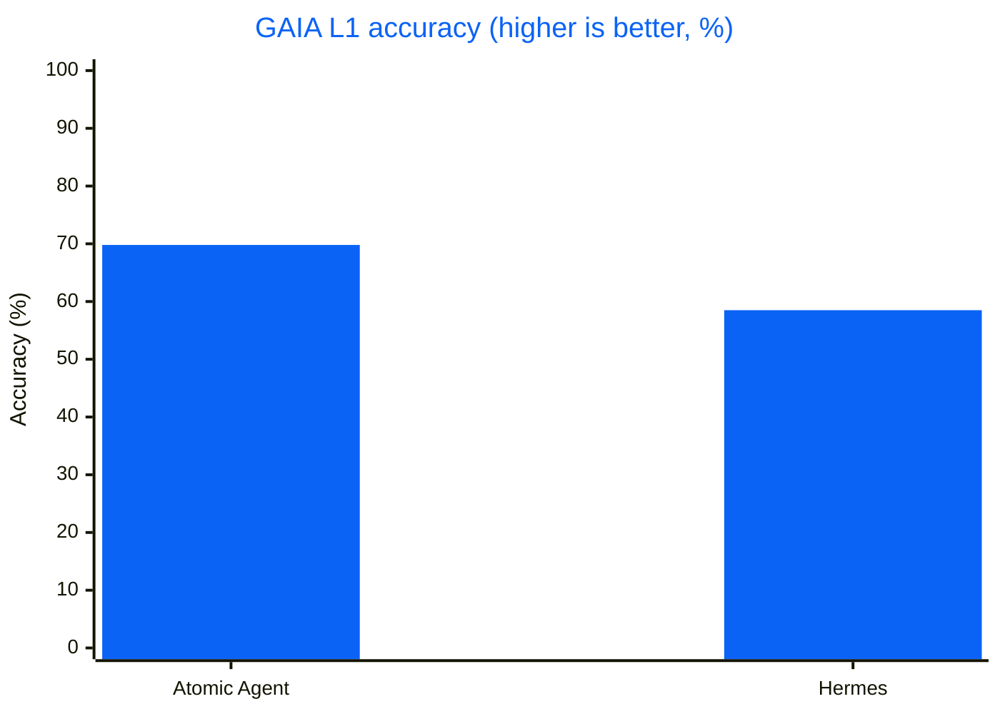
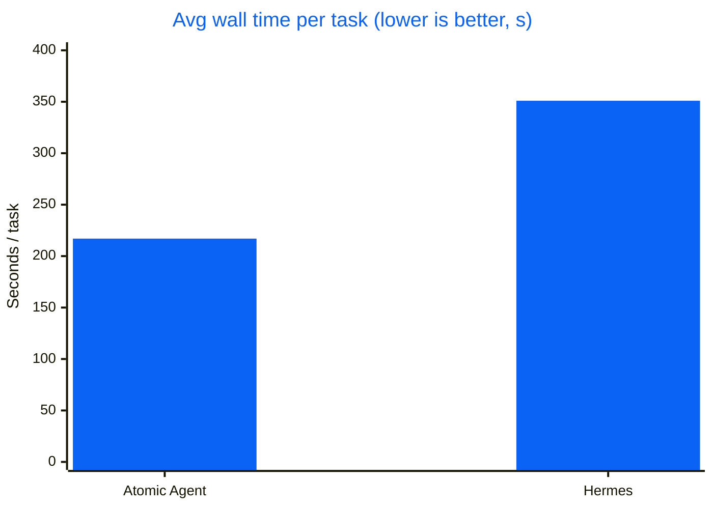
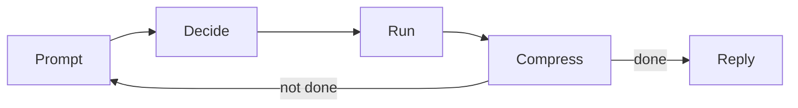

# h0x - CLI

**Built by TEAM PAVii.Ai** · [pavii.tech](https://pavii.tech) · [Documentation placeholder](https://pavii.tech/docs)

A local-first terminal agent with local or cloud models. Typing `h0x-cli` opens the existing full-screen interface in the same terminal and uses your current directory.

This is a development-stage fork of [Atomic Agent](https://github.com/AtomicBot-ai/atomic-agent). Its history, MIT license, upstream copyright, and third-party attribution are preserved. This first stage changes the command identity and terminal branding, not the agent's core behavior or protocols. Public releases and h0x distribution packaging are not ready.

## Quick Install

### Local Windows Development

Use Node **25.7 or newer** from a G-drive directory. In this workspace, Node 25.7.0 is unpacked at `G:\h0xi\atomic-agent\.local\runtime\node-v25.7.0-win-x64`. A fresh clone needs that runtime installed first; it is not committed.

From `G:\h0xi\atomic-agent` in PowerShell:

```powershell
$nodeDir = Join-Path $PWD '.local/runtime/node-v25.7.0-win-x64'
$env:PATH = "$nodeDir;" + $env:PATH
$env:TEMP = $env:TMP = $env:TMPDIR = Join-Path $PWD '.local/tmp'
$env:npm_config_cache = Join-Path $PWD '.local/npm-cache'
$env:npm_config_devdir = Join-Path $PWD '.local/node-gyp'
$env:PLAYWRIGHT_BROWSERS_PATH = Join-Path $PWD '.local/browsers'
New-Item -ItemType Directory -Force $env:TEMP | Out-Null
npm ci --no-audit --no-fund
.\scripts\install-local.ps1 -NodeDirectory $nodeDir
```

The helper builds the app, links the package under `.local/prefix`, and installs pinned launchers under `.local/bin`. It adds only that bin directory to your user PATH. Its launchers preserve the invoking directory and terminal streams, while directing runtime state, temporary files, npm cache, and browser downloads to this workspace on G:.

Open a new terminal after installation, move to your project directory, then run:

```text
h0x-cli
```

First-run model setup and existing permissions are preserved. The welcome displays the installed version, the actual selected model, current directory, and Git repository/branch when available. The `pavii.tech/docs` address is a temporary placeholder, not a promise of live documentation.

Compatibility aliases remain: `atomic-agent`, `atag`, and `atomic-agent-sidecar`. Existing config keys, `ATOMIC_AGENT_*` environment variables, and storage discovery are unchanged. Outside the local launchers, set `ATOMIC_AGENT_STATE_DIR` explicitly when you need G-drive storage.

### Updates and Removal

App update checks and installers are disabled in this build, including `h0x-cli update --check` and `--version`. Update the source checkout through Git and rebuild. Do not use the inherited upstream release installers for h0x-cli; public installation/release packaging is a later stage. Managed model/backend downloads are a separate, unchanged feature.

The inherited `uninstall` command still targets legacy installation layouts and can delete persistent data. It is not an uninstaller for this development checkout; use `h0x-cli uninstall --dry-run` only to inspect its plan. Do not run a destructive uninstall to remove the local development launcher.

### Support and Project Records

Report issues in [h0x-cli-v3](https://github.com/vjk7989/h0x-cli-v3/issues). See the [architecture record](docs/rebrand/decisions.md), [handoff](docs/rebrand/handoff.md), and [engineering guide](AGENTS.md) for scope, compatibility decisions, and verification status.

## Benchmarks

The following results and graphics are historical **upstream Atomic Agent** evaluations. They have not been rerun or certified as h0x-cli benchmarks.

On the public **GAIA validation Level 1** split (53 tasks), Atomic Agent and Hermes drove the **same** local `qwen-3.6-35b-a3b` (`llama-server`, UD-Q4_K_XL), with the same step budget and timeout. The only variable is the agent loop.


| Metric | Atomic Agent | Hermes |
|---|---|---|
| **Accuracy** | **37/53 = 69.8%** | 31/53 = 58.5% |
| Avg wall / task | **~217 s** | ~351 s |
| Head-to-head wins | **+15 atomic-only** | +9 Hermes-only |

<details>
<summary><b>Charts (accuracy &amp; speed)</b></summary>





</details>

### Model Scaling

The same loop holds up as the local model shrinks. Same GAIA L1 split, Atomic Agent alone:

| Chat model | Accuracy | Avg wall / task |
|---|---|---|
| `qwen-3.6-35b-a3b` (UD-Q4_K_XL) | **37/53 = 69.8%** | ~217 s |
| `qwen-3.5-9b` (Q4_K_M) | **28/53 = 52.8%** | ~152 s |
| `gemma-4-12b` (it-qat UD-Q4_K_XL) | **24/53 = 45.3%** | ~423 s |

Even a 9B model clears half of GAIA L1 through the same context-frugal loop. (Different Atomic Agent versions per row; see the write-up for provenance.)

Full reproducible write-up: [`GAIA-L1-EXPERIMENT.md`](eval-agents/docs/GAIA-L1-EXPERIMENT.md) · Raw artifacts (matrices, NDJSON traces, logs): [gaia-l1-eval-2026-06-11 release](https://github.com/AtomicBot-ai/atomic-agent/releases/tag/gaia-l1-eval-2026-06-11).

## Why Local-First

The control loop and all state run on your machine, not a hosted service:

- **State lives on your disk.** Sessions, memory, tasks, traces, skills, browser profile, config, and `.env` secrets live under `<stateDir>` as plain files and SQLite databases. See [Privacy and Egress](#privacy-and-egress) for what can leave the machine and how to switch it off.
- **No API costs.** Run quantized models locally through `llama.cpp`. Bring your own `llama-server` or let the CLI manage one.
- **Nothing is hidden.** Inspect the prompt, replay trace drift, edit skills, and swap parts without waiting for a vendor. Plain local models, SQLite files, and NDJSON traces.
- **Runs on your hardware.** Small quantized models run on everyday consumer GPUs and CPUs, no datacenter needed.

## Core Idea

### How the Agent Loop Works

An agent is a loop: the model picks an action, something runs it, the result feeds back in, and it repeats until the job is done. The catch is cost. Every turn re-sends the growing context through the model, so a naive loop gets slower and pricier each pass, and small local models choke on it fastest.

h0x-cli keeps the loop cheap. One inference produces one JSON array of tool calls, and it runs them without re-encoding the whole world every turn:



1. **Prompt:** a compact prompt goes to the local model.
2. **Decide:** the model returns one JSON array of tool calls, grammar-checked so the format is always valid.
3. **Run:** the core executes them; independent reads run in parallel, risky actions ask first.
4. **Compress:** results and state are summarized, not pasted back in full.
5. **Repeat:** loop again until reply, finish, cancel, or a max-step limit.

The model chooses actions. h0x-cli owns the loop, the state, the approvals, the traces, the stop conditions, and the failure boundaries.

### Built to Make Local Models Work

Managed local models currently use the upstream TurboQuant `llama.cpp` ([`AtomicBot-ai/atomic-llama-cpp-turboquant-nightly`](https://github.com/AtomicBot-ai/atomic-llama-cpp-turboquant-nightly)):

- **TurboQuant KV-cache:** WHT-rotated low-bit quantization compresses the KV-cache up to ~6.4× versus F16, with a fused Metal decode kernel, so long-context sessions fit in far less memory.
- **TurboQuant weights:** Lloyd-Max weight quantization with WHT rotation and fused Metal/Vulkan kernels keeps quality usable while small models fit on consumer hardware.
- **Custom speculative decoding:** purpose-built Gemma 4 MTP and Qwen 3.6 NextN heads reuse the loaded model (no second context, tokenizer, or model load) for +30-50% throughput.
- **Curated quantized models:** hand-picked GGUF quants that keep quality usable while fitting real VRAM budgets.
- **Managed mode:** the CLI downloads, pins, and runs the backend and models for you, no manual `llama.cpp` setup.

### Tuned for Small Local Models

h0x-cli's prompt is engineered so a small model never wastes tokens or breaks format:

- **Stable prefix:** persona, rules, tools, skills, capabilities, and instructions stay byte-stable inside a session so `cache_prompt` and `slot_id` can reuse KV-cache instead of re-encoding the prompt every turn.
- **Bounded tail:** conversation, memory, world state, recalled notes, lessons, procedures, and loaded skill bodies are clipped into a predictable prompt budget.
- **Externalized state:** sessions, memory, tasks, skills, traces, browser snapshots, and model config live outside the prompt.
- **GBNF tool calls:** completions are constrained into a JSON array of tool calls, including the solo case `[{...}]`.
- **Parallel read batches:** independent read-only calls can run concurrently after a single inference; dangerous actions remain approval-gated.
- **Compact browser view:** ordinary web operation uses accessibility / ARIA snapshots clipped to a character budget (24k by default) instead of screenshot-heavy page dumps.

This is why small local models can stay useful across long, tool-heavy work.

## What It Can Do

h0x-cli drives a full desktop tool surface. Dangerous actions are routed through approvals; independent read-only calls run in parallel.

| Area | Capabilities |
|---|---|
| **Browser** | Navigate, click, type, search, manage tabs, scroll, and read compact ARIA state via `playwright-core` (Chrome / Edge / Chromium). |
| **Web & HTTP** | Web search with configurable providers (Exa, DuckDuckGo, Brave, SearXNG); fetch and extract pages or make arbitrary HTTP requests, both SSRF-guarded, separate from the browser. |
| **Filesystem & shell** | Read, write, edit, patch, glob, grep, diff, watch, hash, list, archive extract, run approved shell commands, and inspect or kill processes. |
| **Desktop** | Clipboard read/write, desktop notifications, and window list/focus. |
| **Documents** | Extract text locally from PDF, DOC, DOCX, XLSX, PPTX, ODT, RTF, and plain text. |
| **Git** | Read-only status, log, diff, show, blame, and branch inspection. |
| **Memory** | Profile facts, notes with hybrid recall, links, lessons, procedures, voting, and reflection. |
| **Tasks** | Durable deferred turns, cron schedules, intervals, webhooks, and agent-created reminders. |
| **Skills** | View and run Markdown skill playbooks (scripts are approval-gated), install more from ClawHub. Ships with 17 starter skills (Docker, GitHub, Notion, Obsidian, PDF, and more), auto-installed on first run. |
| **Vision** | Optional `vision.describe` for multimodal models with `mmproj`, kept outside the text transcript. |
| **MCP** | Connect external MCP servers; their tools, resources, and prompts join the same registry. |
| **Providers** | Local `llama-server` by default; OpenAI-compatible, [OpenRouter](https://openrouter.ai), AI/ML API, and Gemini providers when configured, with live model catalogs and mid-session switching. Your existing **Claude Code and OpenAI Codex subscriptions** work too, driven through their own signed-in CLIs with no API key. Reasoning-only completions from reasoning models are recovered instead of failing the turn. |
| **Telegram** | Single-user remote control with owner pairing, inline approval buttons, and opt-in result reports from scheduled tasks. |

### Memory That Grows Outside the Prompt

h0x-cli's memory is not a giant chat log pasted back into the prompt. It's a local, inspectable store: durable identity, episodic notes, associations, distilled lessons, and reusable procedures. The prompt sees compact pointers, and full bodies are recalled by tool call only when the agent needs them.

- **Profile facts** render into `### profile` with contextual keyword gating; facts are versioned, with queryable history.
- **Notes** are stored in SQLite + FTS5, optionally paired with embeddings for hybrid recall.
- **Links** connect related memories into a bounded graph.
- **Lessons** distill repeated episodes into reusable principles.
- **Procedures** distill how-to templates without auto-executing them.
- **Voting** lets useful or harmful memories, lessons, procedures, and profile facts drift up or down.
- **Dedup and eviction** merge near-duplicate memories and evict by usefulness, not age, on by default.
- **Reflection** runs after turns, off the main agent slot, and writes memory without blocking the reply.

## Ways to Use It

<details>
<summary><b>TUI and CLI</b></summary>

Use the CLI for simple sessions, automation, and debugging. Use the TUI for an interactive control console: approvals, logs, models, skills, tasks, memory, MCP, Telegram, and traces.

```bash
h0x-cli run --cwd /path/to/work
h0x-cli tui --cwd /path/to/work

h0x-cli skill list
h0x-cli task list
h0x-cli trace list --limit 10
```

**The context readout.** The chip at the right of the composer gauges the prompt against the model's real context window — `8/20 tasks · 39.9k/48k` — so you can see whether there is room for what you are about to send. History is limited in **tasks**, not tokens: one task is a thing you asked plus everything the agent did answering it, and `agent.conversationMaxPairs` (1-100, default 20) says how many the prompt carries. Tokens are the wrong unit to steer with — nobody thinks in them — but they are still the ceiling underneath, because one task can run twenty tool calls and no task count keeps a prompt inside the window on its own. Once history has been dropped it says so in words (`· 3 tasks lost`) and turns violet: that is the point where the agent stops knowing things it knew a minute ago, and answers quietly start getting less consistent. Cloud models take their window from the model catalogue, so the gauge is drawn against a real scale there too; when nothing knows the window at all it falls back to the transcript's own ceiling, labelled `cap` so the number cannot be mistaken for one.

Click the chip (or `/context`) for the breakdown, and for the one control that matters: a selector for how many tasks the next prompt carries, with a button either side of the number (`-` and `+` from the keyboard). Every figure above it — the total, the percentage, the `conversation` row, the free space — recalculates as you move it, so the cost of the choice is on screen while you are making it rather than one turn later. Each step applies immediately; there is nothing to confirm.

`agent.conversationMaxTokens` still exists as the ceiling underneath, and `0` makes it fill whatever the window leaves — worth setting if you size your own `llama-server` with `-c`. It is no longer something you have to think about: the task count is the limit you steer with, and the token cap only intervenes when a single task is large enough to threaten the window on its own.

Handy slash commands: `/help` lists every command, `/tools` lists the built-in tool families, `/model` jumps to the LLM panel and reopens the model picker for the active cloud provider, `/privacy` shows what leaves the machine (`/privacy analytics off` turns analytics off). The chat log scrolls with PgUp / PgDn (fn+arrows on macOS).

**Coding modes.** A chip at the right end of the composer's bar says which rules are in force. Clicking it — or `ctrl+g M`, or `/mode` — opens a menu of the four, each with a line saying what it does; ↑↓ moves, Enter applies, Esc cancels. `/mode <name>` sets one directly without the menu.

| mode | |
|---|---|
| `default` | approvals follow the level set on the Privacy tab |
| `plan` | read-only — every tool that would change something is refused, with a note telling the agent to present a plan instead. Reading, searching and fetching all still work. When the plan lands, three buttons appear **under the plan itself**, beside its `[copy]` row: run it in `auto`, run it in `bypass permissions`, or dismiss it. Typing instead keeps you in plan mode and revises the plan — the composer says so while the offer is up. |
| `auto` | file writes inside this workspace stop asking; everything else still does |
| `bypass permissions` | nothing asks, for this session. Hardline shell-guard rules still block. |

All four are session state and none are written to `config.json` — a `bypass` that survived a restart would be a standing grant nobody remembers making. `default` restores the level you actually configured, so a session that passed through `bypass` and back lands where it started. The cycle order keeps `plan` and `bypass` two presses apart in either direction.

**Answering an approval prompt.** The prompt draws its verbs as buttons — click one, or use its chord: `ctrl+y` approves the call, `ctrl+d` denies, `ctrl+f` grants its category for the session, `esc` aborts the run. Every decision is a chord and never a bare letter, because the input field below stays live: typing "yes, but put it somewhere else" must be a message, not a verdict. Two more ways out:

- **`ctrl+b` — write it somewhere else.** On an `os.fs.write` prompt the target path becomes an editable field, prefilled with the full path. Type any other target (`~` works, missing folders are created) and Enter confirms it. The new path is re-checked against the approval ladder first: a target on the same rung as the one you approved is written, a target on a different rung (workspace → home, say) asks once more, and a target that is the agent's own `config.json` / `.env` is refused.
- **Just type.** The input field stays live under the prompt, so you can answer the agent in words — "put the site in ~/Documents/apple-site and use an inline SVG". Enter cancels the pending call with your message as its reason (the model reads it as the tool result) and folds the same text into the running turn, so the run keeps going instead of dying. The chords keep working while you type, so you can start a message, change your mind, and approve without clearing it first. `esc` is the one exception: with a draft in the buffer it clears the draft rather than aborting the run.

On a `shell` prompt `ctrl+b` grants the command's *shape* for the session (`git`, `npm`) instead of the whole category — except for `bash -c`-style interpreters, where the binary name hides what actually runs, so no shape grant is offered. The retarget and the shape grant share `ctrl+b` because they can never both be on screen: one is `os.fs.write` only, the other `shell` only.

**Look.** The TUI ships with the `classic-dark` palette: an indigo rail, raised `+ new` / `≡ Menu` / `send →` controls, a `RUN` badge and session title in the top bar, `AGENT` / `YOU` labels on the transcript, and green tool results. Five more ship with it — `classic-light`, `toxic-green`, `khorne-red`, `darky-dark` and `moon-yellow`. `/theme` lists them, `/theme <name>` switches, and the choice persists.

All six are designed here rather than transcribed from upstream terminal themes, and every colour pair the UI paints is held to WCAG AA by `theme-contrast.test.ts`. The registry that preceded them carried twelve palettes and failed that check on 154 of its 396 pairs — including light text on the light status-bar ground at 1.09:1. Configs naming one of the retired themes are rehomed to the nearest surviving palette rather than silently reset.

**Small windows.** The layout degrades as the window shrinks — the right rail drops at 100 columns, the splash art steps down through three sizes, the chrome grows a row under 60 columns — down to a floor of **40x16**. Below that it stops: Ink overlaps a frame taller than the terminal instead of clipping it, so a 16-row UI in a 10-row window is two UIs painted over each other rather than a cramped one. Under the floor the app draws a single card saying what it needs and what it has, on the main screen and the first-run screen alike, and goes back to the real UI as soon as the window is dragged big enough.

**Mouse.** The TUI is clickable: the breadcrumb (which opens the menu, the same as `ctrl+p`), sidebar sessions and tasks, every list row (skills, tasks, memory, MCP, models, providers), the session / theme / slash pickers, approval buttons, tool cards, and the prompt itself — clicking in the input places the caret. A click selects a row, a second click on the selected row opens it, and the wheel scrolls the chat or walks the focused panel.

While mouse reporting is on the terminal hands clicks to the app, which means its own drag-to-select is unavailable (iTerm2, GNOME Terminal and Windows Terminal let you hold Shift to bypass; Apple Terminal does not). Turn it off whenever you want to select text: `/mouse off` in the app, `h0x-cli tui --no-mouse` for one run, or `"tui": { "mouse": false }` in `<stateDir>/config.json`. With mouse off, wheel scrolling still works through the terminal's alternate-scroll mode, exactly as before.

Cloud provider setup pulls each provider's full live model catalog, hundreds of models, instead of a short hardcoded list; OpenAI-compatible servers are asked for their own `/v1/models`. The picker filters as you type, and `/model` switches models mid-session.

A cloud key is checked before it is saved. The key screen refuses an empty key, and finishing the wizard asks the provider for a one-token completion from its cheapest model: a key that is rejected, or attached to an account with no balance, never reaches `.env` and never becomes the active provider. A provider that cannot be reached at all still saves, with a line saying the key went unverified — an offline or proxied machine stays configurable. Local servers have no account to check and are left alone.

</details>

<details>
<summary><b>Managed local models</b></summary>

The CLI can manage a paired `llama.cpp` setup for chat and embeddings:

```bash
h0x-cli models update
h0x-cli models list
h0x-cli models pull qwen-3.5-4b
h0x-cli models use qwen-3.5-4b

h0x-cli models list-embeddings
h0x-cli models pull-embedding <model>
h0x-cli models use-embedding <model>

h0x-cli models start

h0x-cli tui --cwd /path/to/work
```

Managed mode downloads the backend, pulls GGUF models, selects the active model, and starts detached chat / embedding daemons when configured.

The managed chat daemon stops when the last session exits, freeing the RAM and VRAM the model was holding; set `localModels.managed.stopOnExit: false` in `config.json` to keep the model warm between sessions. Daemons started standalone with `models start` are never touched.

Cloud models are searchable from the same command — by id, vendor, or capability, across every configured cloud provider:

```bash
h0x-cli models search claude vision
h0x-cli models search free tools --json
h0x-cli models search "1m cache" --provider openrouter --limit 10
h0x-cli models search kimi --refresh   # pull live /models lists first
```

Every term has to match (`claude vision` is not a substring of any id), a size term names a whole-unit bucket whatever the row displays (`1m` finds windows from 1M up to 2M, including the 1,048,576-token ones that render as `1.0M`; a 2M window answers to `2m`; `128k` finds 131,072), results are ranked best-first, and the same query works in the TUI Cloud pane — press `f`.

</details>

<details>
<summary><b>External <code>llama-server</code></b></summary>

Already have your own `llama.cpp` process? Point `h0x-cli` at it:

```bash
export ATOMIC_AGENT_LLAMA_URL=http://127.0.0.1:8080

./llama-server -m Qwen3.5-9B-Q4_K_M.gguf \
  --slots 4 \
  --parallel 4 \
  --port 8080 \
  --cache-reuse 256

h0x-cli tui --cwd /path/to/work
```

The LLM tab in the TUI has an External pane for this setup. Saving a URL runs an honest health probe: it validates the `/health` body, reports llama.cpp's 503 answer while a model loads as loading rather than dead, and recognizes when the URL is a different OpenAI-compatible runner that should be added as a cloud provider instead.

</details>

<details>
<summary><b>Ollama and LM Studio (local)</b></summary>

Running models under [Ollama](https://ollama.com) or [LM Studio](https://lmstudio.ai)? Both are OpenAI-compatible servers, and both are presets in the provider wizard, so there is no base URL to type.

```bash
ollama serve
ollama pull qwen2.5:0.5b

h0x-cli tui --cwd /path/to/work
```

In the TUI, open the LLM tab, add a provider, and pick **Ollama (local)** (or **LM Studio (local)**). A local server has no API key, so the wizard skips the key screen and goes straight to the model choice: two screens, service then model.

Model ids are the tags the server reports, `qwen2.5:0.5b` or `llama3.2:latest` for Ollama, so use the same name you passed to `ollama pull`. The list comes from the server's own `/v1/models`, which means anything you have pulled shows up without a restart.

The preset is a fixed `http://localhost:11434` endpoint — it does not probe for a running server. If `ollama serve` isn't up when you reach the model step, the list fails to load (`could not list models from Ollama (local)`), and the wizard falls back to letting you type a model id by hand; in the LLM panel the list shows `model list unavailable` and only the current model. Start the server (`ollama serve`, then `ollama pull <model>` for anything you want) and re-open the preset.

| Preset | Endpoint |
| --- | --- |
| Ollama (local) | `http://localhost:11434` |
| LM Studio (local) | `http://localhost:1234` |

Two things to know. Ollama's OpenAI-compatible surface lives under `/v1`, but the base URL is stored without it, since every call site appends `/v1/...` itself. And **Ollama (local)** is a different entry from **Ollama Cloud**: the first is the server on your machine and needs no key, the second is the hosted endpoint.

Tool calling works over this path, so the agent loop runs normally, but it is only as reliable as the model you picked. Very small models emit malformed tool calls more often; if the loop stalls, try a larger one before assuming the provider is at fault.

</details>

<details>
<summary><b>OpenAI-compatible HTTP</b></summary>

Run `h0x-cli` as a local HTTP service:

```bash
h0x-cli serve \
  --host 127.0.0.1 \
  --port 8787 \
  --cwd /path/to/work \
  --api-key "$ATOMIC_AGENT_API_KEY"
```

`POST /v1/chat/completions` maps one request to one full macro-turn: `user -> 0..N tool steps -> reply`. Atomic-specific routes expose sessions, approvals, tasks, webhooks, events, skills, config, and capabilities.

</details>

<details>
<summary><b>Tauri sidecar</b></summary>

The sidecar speaks newline-delimited JSON over stdio, making it easy to embed in desktop apps:

```json
{"kind":"request","id":"r-1","type":"start_session","payload":{"workingDir":"/home/me"}}
{"kind":"request","id":"r-2","type":"send_message","payload":{"sessionId":"s-1","text":"Check the inbox and summarize urgent mail."}}
```

Events stream back as the turn runs:

```json
{"kind":"event","id":"e-1","type":"turn_started","correlationId":"r-2","payload":{"sessionId":"s-1","turnIndex":0}}
{"kind":"event","id":"e-2","type":"tool_call_result","correlationId":"r-2","payload":{"sessionId":"s-1","stepIndex":0,"tool":"browser.read_aria","status":"ok","summary":"url: https://mail.google.com/ ..."}}
{"kind":"event","id":"e-3","type":"assistant_reply","correlationId":"r-2","payload":{"sessionId":"s-1","text":"You have 3 urgent threads."}}
```

</details>

<details>
<summary><b>Telegram remote control</b></summary>

Enable a personal Telegram bot and drive the same agent from your phone:

```jsonc
// <stateDir>/config.json
{
  "telegram": { "enabled": true, "ownerUserId": null }
}
```

```bash
# <stateDir>/.env
TELEGRAM_BOT_TOKEN=123456789:AA-your-bot-token
```

The TUI can store the token, start the channel, open pairing mode, and show status. Approvals arrive as inline buttons in your DM. Telegram is intentionally single-user.

While a turn runs, the bot keeps one live progress bubble updated in place. It is sent silently and shows step labels only, never tool output; turn it off with `"telegram": { "progressIndicator": false }`.

Scheduled tasks can report back to the same chat: create a cron job with `h0x-cli task create --cron "0 9 * * *" --message "morning digest" --notify telegram` (or ask the agent to schedule with `notify: "telegram"`), and each run posts its final result to your paired DM when it finishes. Reporting is strictly per-task opt-in, and the report's result text is sent to Telegram's servers; when the channel is down or unpaired the report is skipped with a logged warning and the task itself is unaffected.

</details>

<details>
<summary><b>MCP client</b></summary>

Configure MCP servers in `config.json`, and their tools join the same registry as local tools. Trusted read-only servers can batch with other reads; untrusted servers default to approval-gated execution.

```jsonc
{
  "mcp": {
    "servers": [
      {
        "name": "docs",
        "enabled": true,
        "transport": {
          "kind": "stdio",
          "command": "npx",
          "args": ["-y", "@example/mcp-server"]
        },
        "trust": "pure_read"
      }
    ]
  }
}
```

The TUI MCP panel supports live add / remove without restarting the process. When a stdio server fails to connect, the tail of its stderr is surfaced in the error instead of a bare disconnect message.

</details>

## Safety and Observability

Everything h0x-cli does is inspectable and interruptible:

- **Approval gates:** shell, filesystem writes, patches, archive extraction, process kill, HTTP requests, skill scripts, and untrusted MCP tools are gated by policy.
- **Append-only traces:** prompts, completions, tool invocations, outcomes, failure categories, votes, and lifecycle events recorded as local NDJSON.
- **Prompt drift replay:** `h0x-cli trace replay <sessionId>` compares current stable-prefix hashes against recorded traces.
- **Failure taxonomy:** transport, grammar, model, tool, and cancellation failures classified across events, traces, metrics, TUI, sidecar, and HTTP.
- **No-progress guard:** repeated identical tool calls draw a warning at 3 repeats and a hard veto at 5; after 3 consecutive vetoes the agent is forced into a graceful reply.
- **Per-session FIFO:** every surface enters the same `TurnController`; one session stays ordered while different sessions run concurrently.
- **Explicit state:** sessions, memory, tasks, skills, browser profile, MCP config, and traces are ordinary local files or SQLite databases.

> [!IMPORTANT]
> Treat traces and `<stateDir>/.env` as sensitive local artifacts. Secret redaction and per-tool environment filtering are not complete isolation layers.

### Privacy and Egress

By default, h0x-cli does not require a hosted agent provider. Model calls go to your configured backend, and local artifacts stay under `<stateDir>`.

Upstream PostHog analytics and Sentry crash ingestion are disabled in this h0x-cli build through the existing disabled sentinels, even if an inherited config enables analytics. The legacy privacy setting remains compatible but cannot enable those upstream clients. This does not disable configured model providers, browser requests, MCP servers, Telegram, or managed backend/model downloads.

Local-first bounds where control lives, not where packets go. Network egress happens when:

- the browser navigates to a website;
- an HTTP tool calls a requested endpoint;
- a web search provider answers a query;
- a configured cloud LLM or embedding provider receives its request;
- a `subscription-cli` provider is active and the vendor CLI (`claude` or `codex`) receives your prompt on its stdin, then sends it on under its own account;
- an MCP server receives a tool call you routed to it;
- the Telegram channel is enabled and the bot exchanges messages with your paired chat, including opt-in scheduled task reports;
- you install a skill from ClawHub;
- the TUI checks GitHub Releases for a newer version at startup (set `ATOMIC_AGENT_UPDATE_CHECK_ON_STARTUP=false` to skip);
- analytics or crash reporting is enabled, as described above.

> [!NOTE]
> Skills and shell commands inherit the agent process environment, including `.env` secrets, so anything you run can itself reach the network.

The promise is not magic secrecy. The promise is that the agent control plane does not need to be remote.

## Requirements & Configuration

<details>
<summary><b>Requirements</b> (Node, llama-server, browser, git) + Linux notes</summary>

- Node.js for development; release bundles ship as Node SEA binaries.
- A reachable `llama-server`, either managed by `h0x-cli models` or launched externally.
- Managed mode picks the GPU backend automatically: Metal on Apple Silicon, CUDA on Windows when `nvidia-smi` reports a supported driver (including the reworked driver 610+ headers) with Vulkan as the fallback, Vulkan on Linux, CPU when no GPU is usable. Managed local models ship for Linux x64 only; on arm64 point the agent at an external `llama-server` instead.
- Chrome, Microsoft Edge, or another configured Chromium-family executable. Browser binaries are not bundled.
- `git` for git tools.
- macOS workflows may need Accessibility, Screen Recording, Automation, or Reminders permissions.

**Linux notes:**
- **Desktop tools** (install via your package manager): `ripgrep` (file search; bundled binary used when present), `xclip`/`xsel` (X11) or `wl-clipboard` (Wayland) for clipboard, `libnotify-bin` for notifications, `wmctrl` for window control (X11/XWayland only), `gio` (glib2) or `trash-cli` for `fs.trash`.
- **Browser:** Chromium-family sandboxing can fail under some Linux setups (containers, certain kernels). If Chrome refuses to launch, run it with `--no-sandbox`.
- **GPU acceleration (managed mode):** the backend always starts and falls back to CPU when no GPU driver is available. For GPU offload install a Vulkan driver. Intel/AMD: `mesa-vulkan-drivers` (+ `vulkan-loader`/`libvulkan1`); NVIDIA: the stock proprietary driver bundles its Vulkan ICD. Device auto-selected at start; override with `h0x-cli models use-device <auto|cpu|Vulkan0>`, inspect with `h0x-cli models devices`, or press `G` in the TUI Models tab.

</details>

<details>
<summary><b>Configuration and secrets</b> (state dir, env vars, .env)</summary>

User-facing configuration lives in `<stateDir>/config.json`.

Useful environment variables:
- `ATOMIC_AGENT_STATE_DIR`: state, config, skills, browser profile, memory, tasks, traces. Default: `~/.atomic-agent`.
- `ATOMIC_AGENT_LLAMA_URL`: external `llama-server` URL.
- `ATOMIC_AGENT_LLAMA_API_KEY`: optional bearer token for `llama-server`.
- `ATOMIC_AGENT_LLAMA_MAX_TOKENS`: completion cap.
- `ATOMIC_AGENT_BROWSER_CHANNEL`: `chrome`, `msedge`, or `chromium`.
- `ATOMIC_AGENT_BROWSER_EXECUTABLE_PATH`: explicit Chromium-family executable path.
- `ATOMIC_AGENT_BROWSER_CDP_URL`: attach to an already-running browser via CDP.

Secrets for skills and channels belong in `<stateDir>/.env`, not in `config.json`:

```text
NOTION_API_KEY=ntn_xxxxxxxx
GITHUB_TOKEN=ghp_xxxxxxxx
TELEGRAM_BOT_TOKEN=123456789:AA-your-bot-token
EXA_API_KEY=exa_xxxxxxxx
OBSIDIAN_VAULT_PATH=/Users/me/Documents/Obsidian Vault
```

Shell-exported variables win over `.env`. The built-in parser intentionally supports only simple `KEY=VALUE` lines.

</details>

<details>
<summary><b>Claude Code / OpenAI Codex subscriptions</b> (no API key)</summary>

Drives a vendor CLI you are already signed into, so a flat-rate subscription can power the agent with no API key and no per-token billing. Two are supported: `claude` (Claude Code) and `codex` (OpenAI Codex).

**Prerequisite:** the CLI installed and signed in — `claude` then `/login`, or `npm i -g @openai/codex` then `codex login`. Atomic only spawns the binary; it never reads, copies, or replays its OAuth tokens or keychain entries.

In the TUI: **Providers → `n` →** pick the subscription row, then type a model. For Claude that is `sonnet`, `opus`, `haiku`, `fable`, or a pinned id like `claude-sonnet-5`; **for Codex leave it blank** — under a ChatGPT login Codex rejects explicit model ids (`not supported when using Codex with a ChatGPT account`) and resolves one itself. There is no API-key screen, because there is no key. Equivalent `config.json`:

```json
{
  "llm": {
    "activeTextProvider": "claude-cli",
    "providers": [
      {
        "id": "claude-cli",
        "kind": "subscription-cli",
        "defaultChatModel": "sonnet",
        "subscriptionCli": { "cli": "claude" }
      }
    ]
  }
}
```

Optional keys inside `subscriptionCli`: `binPath` (absolute path when the CLI is not on `PATH`), `extraArgs` (appended verbatim — e.g. `["--effort", "high"]`), `streaming` (set `false` to buffer), `maxBudgetUsd`.

Swap `"cli": "claude"` for `"cli": "codex"` to drive Codex instead, and drop `defaultChatModel`.

Each completion spawns the CLI fresh with the prompt on **stdin** (a two-zone prompt exceeds the 128 KiB argv limit). For `claude` it runs `claude --print` with these flags, which are load-bearing rather than cosmetic:

- **`--tools ""`** — disables Claude Code's own Bash/Edit/Write. Without it a second agent would act on your machine outside Atomic's approval ladder.
- **`--strict-mcp-config`** with no config — keeps your MCP servers out of what should be a stateless completion.
- **`--system-prompt`** — replaces Claude Code's coding-agent prompt, which would otherwise compete with the prompt Atomic already built.
- **`--no-session-persistence`** — Atomic owns session state; CLI-side history would double-count context.
- **`--bare` is never passed.** Its own docs say OAuth and keychain are never read under it, which would defeat the whole feature.

For `codex` it runs `codex exec --json` with `--ephemeral`, `--skip-git-repo-check`, `--ignore-user-config` and `-s read-only`. Three differences are worth knowing, because Codex is a more opinionated agent than Claude's headless mode:

- **There is no `--tools ""` equivalent.** `-s read-only` confines Codex's own tools to reading; it cannot remove them. Left to itself, Codex will try to *perform* the request with its own tools instead of emitting Atomic's tool-call protocol — in testing it answered "I can't find `probe.txt`" after looking in its own working directory. The fix is an explicit completion-engine instruction prepended to the prompt (Codex has no system-prompt flag). It works — verified turns drive `os.fs.read` → `reply` and `os.fs.read` → `os.fs.write` → `reply` with no parse retries — but it is a prompt-level guarantee, not a structural one like `--tools ""`.
- **Codex exits 0 even when the turn fails.** A bad model id, an expired login and a rate limit all produce a clean exit with a `turn.failed` event, so the adapter treats a missing `turn.completed` as a failure rather than trusting the exit code.
- **No streaming.** `codex exec --json` emits the answer in one `item.completed`, with no incremental text events, so this provider buffers instead of pretending to stream.

Not supported on either CLI: vision, embeddings (they stay on the local daemon), and the sampling knobs `temperature` / `top_p` / `top_k` / `seed` / `stop` / `maxTokens` — neither CLI exposes a flag for them, so they are dropped rather than silently approximated. Reconfiguring `binPath` or `extraArgs` means editing `config.json`; the model is changeable from the LLM tab.

Two things worth knowing before you switch a long-running agent onto either: each completion pays roughly 0.8 s of process startup, and subscription plans have session and weekly caps that an autonomous multi-step agent reaches much faster than interactive use. When a cap is hit, the CLI's own message is surfaced verbatim.

> [!NOTE]
> Whether driving a subscription CLI from another agent is acceptable use is the vendor's call, not this project's. Atomic uses the officially documented headless mode and nothing else; the decision to use it is yours.
</details>

<details>
<summary><b>Qwen / Tinker tagged tool calls</b> (opt-in compatibility provider)</summary>

Some Qwen-serving OpenAI-compatible backends (Tinker, certain vLLM/llama.cpp front-ends) emit tool calls as inline `<tool_call><function=…>…</function></tool_call>` text instead of the native `tool_calls` field — they show up as assistant prose and never execute (#105).

To enable the adapter, set the provider `kind` to **`qwen-openai-compatible`** in `config.json` (with `baseUrl` + `defaultChatModel`). Plain `openai-compatible` does **not** enable it — the generic kind is left untouched on purpose. There is no TUI wizard row for this kind yet; it is config-only for now.

```json
{
  "llm": {
    "providers": [
      {
        "id": "tinker",
        "kind": "qwen-openai-compatible",
        "baseUrl": "https://your-tinker-host",
        "defaultChatModel": "Qwen3-32B"
      }
    ]
  }
}
```

Behavior:
- The tagged call is read from `content`, or from `reasoning_content` when content is empty or holds unparseable tag noise.
- Argument values are coerced against the offered tool's JSON schema; a call that does not match is dropped (fail-closed) rather than executed with guessed args.
- Streaming stays live: text/reasoning deltas stream as usual and the buffered final message is adapted once the stream closes.

**Limitation — MCP tools:** the schema coercion supports a fixed JSON-Schema subset and rejects unknown keywords such as `$ref`. Atomic's built-in tools are fine, but MCP tools that ship a draft-07 `inputSchema` with `$ref` (or other unsupported keywords) will fail coercion and remain prose. MCP + tagged Qwen is therefore unsupported for now.
</details>

## Development

```bash
npm install
npm run lint
npm test
npm run build
```

Core docs:

- [PROMPT.md](PROMPT.md): prompt anatomy
- [MEMORY.md](MEMORY.md): memory and recall
- [MEMORY_FABRIC_V2.md](MEMORY_FABRIC_V2.md) / [MEMORY_FABRIC_V2.5.md](MEMORY_FABRIC_V2.5.md): memory roadmap
- [SKILLS.md](SKILLS.md): skill format
- [BUNDLING.md](BUNDLING.md): release packaging
- [AGENTS.md](AGENTS.md): contributor invariants

## Acknowledgements

Built on the shoulders of giants:

- [llama.cpp](https://github.com/ggml-org/llama.cpp): the local inference engine TurboQuant builds on
- [Playwright](https://github.com/microsoft/playwright): browser automation the agent drives
- [better-sqlite3](https://github.com/WiseLibs/better-sqlite3): embedded SQLite (FTS5) for local memory and state
- [Model Context Protocol SDK](https://github.com/modelcontextprotocol/typescript-sdk): external tool and resource integration
- [Ink](https://github.com/vadimdemedes/ink) + [React](https://github.com/facebook/react): the terminal UI
- [grammY](https://github.com/grammyjs/grammY): the Telegram channel
- [pdf.js](https://github.com/mozilla/pdf.js): PDF text extraction, by Mozilla
- [Tauri](https://github.com/tauri-apps/tauri): the desktop shell the agent runs inside as a sidecar
